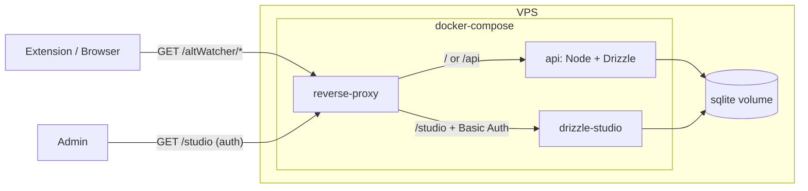

# Node + Drizzle + SQLite + Drizzle Studio в Docker Compose

## Цель

- Бэкенд: Node + Drizzle ORM + SQLite, те же эндпоинты, что в NodeServer/modules/altWatcher/altWatcher.js.
- Дашборд: Drizzle Studio, доступ только через reverse proxy с авторизацией.
- Всё в одном docker-compose; бэкенд живёт в **packages/backend** (как packages/extension).

## Архитектура



- На хост проброшен только reverse proxy (порты 80/443). Сервисы api и drizzle-studio только во внутренней сети compose.
- Один named volume (или bind mount ./data) с файлом .sqlite; к нему имеют доступ контейнеры api и drizzle-studio.
- Путь к БД в контейнерах один и тот же (например /app/data/db.sqlite), в drizzle.config и в коде задаётся через env (DB_PATH).

## 1. Структура репозитория (папка packages)

- **packages/backend/** — новый бэкенд:
  - `package.json` — зависимости: drizzle-orm, better-sqlite3, express, cors, express-rate-limit; скрипты start, db:studio, db:generate, db:migrate.
  - `src/` — сервер (Express), роуты altWatcher, Drizzle-схема и клиент.
  - `drizzle.config.ts` — вывод в одну SQLite-базу; путь из process.env.DB_PATH или дефолт ./data/db.sqlite.
  - `Dockerfile` — multi-stage: установка зависимостей, копирование кода, node server.js.
- **docker-compose.yml** в корне репозитория (рядом с packages/):
  - Сервис **api**: build из `./packages/backend`, volume с данными в /app/data, env DB_PATH=/app/data/db.sqlite.
  - Сервис **drizzle-studio**: тот же образ, команда `drizzle-kit studio --host 0.0.0.0 --port 4983`, тот же volume и DB_PATH.
  - Сервис **reverse-proxy** (Caddy): порты 80/443 на хост, Basic Auth для /studio.

Итоговая структура:

```
├── packages/
│   ├── extension/   # существующее расширение
│   └── backend/     # Node + Drizzle + SQLite, API + Dockerfile
├── docker-compose.yml
├── NodeServer/      # можно оставить для ориентира или удалить позже
└── ...
```

## 2. Схема БД (Drizzle + SQLite)

Таблица по смыслу как в NodeServer/modules/altWatcher/link_table.sql:

- id — integer primary key autoincrement.
- title, link, description — text.
- manga, anime, ranobe — integer (0/1 или битовые флаги).
- approved — boolean, default false.
- number_of_downloads — integer, default 1.
- is_default — boolean, default false.

Миграции: drizzle-kit generate и drizzle-kit migrate. Файл БД создаётся в volume при первом запуске.

## 3. API (совместимость с расширением)

- GET /altWatcher/link — query: title, manga, anime, ranobe, approved.
- POST /altWatcher/link — body: title, link, description, manga, anime, ranobe; ответ { id }.
- GET /altWatcher/link/:id/inc-num-of-downloads — инкремент number_of_downloads.
- GET /altWatcher/defaultLinks — выборка где is_default = true.
- GET /altWatcher/faq — отдача markdown (файл из volume или из NodeServer при миграции).

CORS разрешающий для расширения. Опционально: GET /health для healthcheck.

## 4. Безопасность

- Drizzle Studio только через reverse proxy (Caddy) по пути /studio с Basic Auth (директива `basicauth`). Пароль через env/секреты или Caddy env, не в репо.
- API без авторизации; **rate limiting по IP** — см. ниже.
- В .gitignore: packages/backend/.env, .env.local.

### 4.1 Rate limiting по IP

Включить в Node-приложении (packages/backend), библиотека **express-rate-limit**.

- **Для каких эндпоинтов:**
  - **POST /altWatcher/link** — ограничить число добавлений с одного IP (спам/мусор). Пример: не более 10 запросов за 15 минут с одного IP; при превышении ответ 429.
  - **GET /altWatcher/link/:id/inc-num-of-downloads** — ограничить накрутку счётчика. Пример: не более 1 запроса в 5–10 секунд на одну пару (IP + link id), или не более 60 запросов в минуту с одного IP на все ссылки суммарно.
- **Чтение** (GET /link, /defaultLinks, /faq) — лимит можно не ставить или сделать мягким (например 300 req/15 min с IP), чтобы защититься от DDoS.
- **Учёт IP за proxy:** запросы приходят через Caddy; реальный IP клиента — в заголовке `X-Forwarded-For`. В express-rate-limit задать `trust proxy: true` (Express тогда возьмёт IP из этого заголовка в `req.ip`). Caddy по умолчанию передаёт `X-Forwarded-For` при `reverse_proxy`.
- **Конфиг лимитов** — вынести в env (например `RATE_LIMIT_POST_WINDOW_MS`, `RATE_LIMIT_POST_MAX`) или оставить дефолты в коде; при необходимости отключать rate limit в dev через флаг.

Итог: в package.json добавить зависимость `express-rate-limit`; в app до роутов подключить middleware для POST /altWatcher/link и для GET /altWatcher/link/:id/inc-num-of-downloads (отдельные лимиты или один общий для «записывающих» эндпоинтов).

## 5. Reverse proxy (Caddy)

- **Caddy** — единственный reverse proxy в compose.
- Конфиг (Caddyfile или адаптер из env): для пути `/studio` и подпутей — `basicauth` (пользователь + хеш пароля через `caddy hash-password`), затем `reverse_proxy drizzle-studio:4983`. Все остальные запросы — `reverse_proxy api:PORT` (порт, на котором слушает Node).
- Caddyfile можно монтировать из репо (например `./caddy/Caddyfile`) или собирать образ с конфигом; секреты (хеш пароля) — через переменные окружения Caddy или отдельный файл, не коммитить в git.

## 6. Порядок внедрения

1. Создать packages/backend с package.json, Drizzle-схемой под SQLite, drizzle.config.ts и миграциями.
2. Реализовать Express-роуты altWatcher + раздача FAQ + rate limiting по IP (express-rate-limit для POST /link и inc-num); проверка локально с DB_PATH=./data/db.sqlite и npm run db:studio.
3. Добавить Dockerfile в packages/backend.
4. Написать docker-compose.yml в корне: volume, api (build: ./packages/backend), drizzle-studio, reverse-proxy.
5. Настроить Caddy (Caddyfile, Basic Auth для /studio, проксирование на api и drizzle-studio).
6. Обновить README: структура с packages/backend, как поднять docker-compose, как задать пароль для Studio.
7. Интеграция расширения с API: ввести базовый URL из env (раздел 8), в background/options подменить вызовы на fetch к API при заданном URL; fallback на текущее локальное поведение.
8. Управление сборкой: в packages/extension добавить .env.development (localhost), .env.production (прод URL), скрипт build:local при необходимости; описать в README.

## 7. Интеграция расширения (packages/extension) с API

- Расширение должно уметь работать с бэкендом (packages/backend или развёрнутый на VPS): запросы на получение списка ссылок, дефолтных ссылок при установке, инкремент счётчика, FAQ, добавление ссылки.
- **Базовый URL API** задаётся **на этапе сборки** через одну env-переменную на всё расширение (см. раздел 8). В коде — один общий базовый URL (например из `import.meta.env.VITE_API_BASE_URL`); все запросы к бэкенду идут на `{baseUrl}/...` (сейчас только altWatcher: `{baseUrl}/altWatcher/...`).

**Где менять логику (сейчас в коде есть TODO):**

- **background.ts:** при `getAltWatcherLinks` — если базовый URL задан, запрос к `GET {baseUrl}/altWatcher/link` (с нужными query), ответ отдать вызывающему; иначе по-прежнему `getAllLinks()` из IndexedDB. При `onInstalled` — если базовый URL задан, запрос к `GET {baseUrl}/altWatcher/defaultLinks`, результат записать через `putLinks`; иначе `putLinks(DEFAULT_LINKS)`. При `altWatcherLinkUsed` — если базовый URL задан, вызвать `GET {baseUrl}/altWatcher/link/:id/inc-num-of-downloads` (нужен id с бэкенда; при гибриде локальный `hash_id` может не совпадать с серверным `id`, тогда либо хранить маппинг, либо при использовании API не вызывать локальный inc, а только серверный по id из объекта ссылки).
- **AltWatcher.vue (options):** загрузка FAQ — если базовый URL задан, `fetch({baseUrl}/altWatcher/faq)`, иначе текущий захардкоженный текст. Отправка новой ссылки (POST) — если базовый URL задан, `fetch({baseUrl}/altWatcher/link`, method POST, body JSON), иначе оставить текущее поведение (локально или заглушка).
- **Search.vue (options):** список ссылок — уже идёт через сообщение к background (`getAltWatcherLinks`); при включённом API background вернёт данные с сервера, менять только при необходимости формат ответа (совместимость полей: id, title, link, description, manga, anime, ranobe, approved, number_of_downloads и т.д.).

**Стратегия:** при заданном базовом URL приоритет у API (чтение списка, дефолты, FAQ, inc-num, POST); при отсутствии или при ошибке сети — fallback на текущее локальное поведение (IndexedDB, DEFAULT_LINKS), чтобы расширение работало и без бэкенда.

### 7.1 Сохранение данных пользователей в IndexedDB

- **Не терять данные:** у пользователей, которые уже пользуются расширением, в IndexedDB могут быть свои ссылки (добавленные вручную или накопленные за время). При интеграции с API эти данные **не должны перезаписываться и не должны пропадать**.

**Правила:**

- **onInstalled (первая установка / обновление):** при наличии базового URL запрашивать дефолтные ссылки с API и вызывать `putLinks` **только если IndexedDB пуст** (`getAllLinks()` возвращает пустой массив). Если в IDB уже есть записи — не трогать их (как сейчас в коде: `if (results.length > 0) return`).
- **getAltWatcherLinks (список ссылок):** при работе с API не подменять локальные данные полностью. Варианты: (1) **объединение** — запрос к API + `getAllLinks()` из IDB; объединить оба списка (например по полю `link` или `title` дедуплицировать), вернуть один общий список, чтобы и каталог с сервера, и ссылки, добавленные пользователем локально, отображались; (2) либо приоритет API, но тогда ответ API использовать только для отображения, а в IDB **ничего не удалять и не очищать** — локальные записи остаются и при следующем отключении API снова видны. Предпочтительно (1), чтобы пользователь сразу видел и серверный каталог, и свои локальные ссылки.
- **Никогда не вызывать** `clearLinks()` или `putLinks(serverLinks)` так, чтобы заменить все существующие записи в IDB без явного действия пользователя (например «синхронизировать с сервером» с подтверждением). Любая запись в IDB с данными с API (например после объединения) должна **добавлять/обновлять по одной записи или мержить**, а не делать «полная замена».
- **altWatcherLinkUsed:** инкремент на сервере по id; локальный счётчик `used` в IDB при желании можно по-прежнему обновлять для локальных записей (чтобы локальные данные не «откатывались»).

Итог: IndexedDB остаётся источником пользовательских данных; API дополняет каталог и даёт дефолты при пустой БД. Никаких массовых перезаписей или очисток IDB без явного решения пользователя.

## 8. Управление базовым URL при сборке (env-файлы)

- Цель: собирать расширение **под локальный бэкенд** (localhost) и **под прод** (боевой URL API) без правок кода, только через env при сборке.
- **Один базовый URL на всё расширение.** В WXT/Vite переменные для клиента задаются через префикс `VITE_`. Переменная: `**VITE_API_BASE_URL**` — корень бэкенда (без слэша в конце). Все запросы расширения к серверу: `{baseUrl}/altWatcher/...` и при появлении других модулей — `{baseUrl}/...`. Значение подставляется в бандл при сборке; в коде читать в одном месте, например `import.meta.env.VITE_API_BASE_URL`, и экспортировать константу/хелпер (например `apiBaseUrl`), чтобы все модули расширения использовали её.

**Env-файлы в packages/extension:**

- **.env** или **.env.development** — для сборки под локальный бэкенд. Пример: `VITE_API_BASE_URL=http://localhost:8081`. Секреты в .env не коммитить; localhost можно.
- **.env.production** — для прода. Пример: `VITE_API_BASE_URL=https://your-api.example.com`. Продовый URL — в репо или только в CI.
- **.env.submit** — при необходимости добавить туда `VITE_API_BASE_URL` для прод-сборки при публикации.

**Режимы сборки:**

- **Локальная сборка (под localhost):** скрипт `build:local` с `--mode development` и `.env.development` с `VITE_API_BASE_URL=http://localhost:8081`.
- **Продовая сборка:** `npm run build` (mode production), подхват `.env.production` или задать `VITE_API_BASE_URL` в CI.

**Итог:** одна переменная `VITE_API_BASE_URL`, одна константа/хелпер в коде расширения; все запросы к бэкенду строятся от неё. В README описать: local — .env.development с localhost, prod — .env.production или CI.

## Важные пути

| Назначение          | Путь                                                                                         |
| ------------------- | -------------------------------------------------------------------------------------------- |
| Бэкенд              | packages/backend/                                                                            |
| Схема и миграции    | packages/backend/src/db/schema.ts, packages/backend/drizzle/                                 |
| Конфиг Drizzle      | packages/backend/drizzle.config.ts                                                           |
| Роуты API           | packages/backend/src/routes/altWatcher.ts                                                    |
| Docker              | packages/backend/Dockerfile, docker-compose.yml в корне                                      |
| Caddy               | Caddyfile в корне или в каталоге caddy/                                                      |
| Extension env       | packages/extension/.env, .env.development, .env.production                                   |
| API base URL в коде | Одна константа/хелпер из import.meta.env.VITE_API_BASE_URL (один base URL на всё расширение) |
